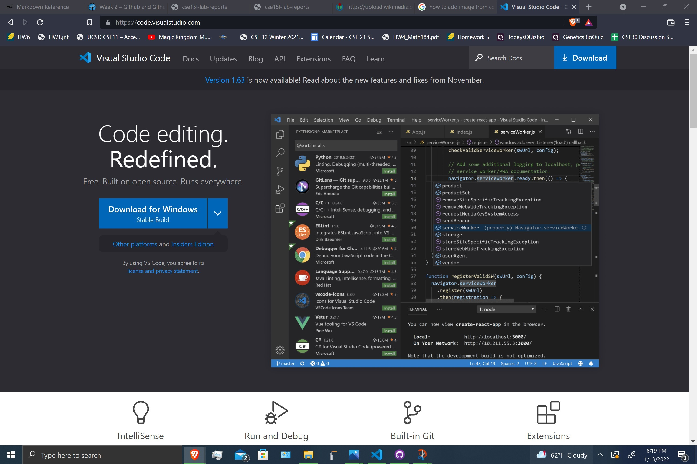
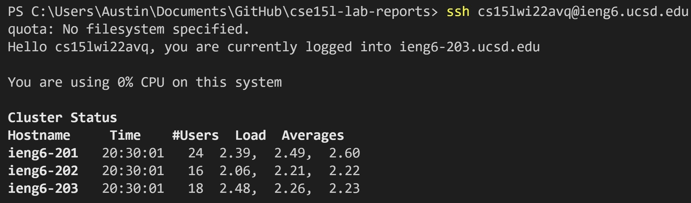
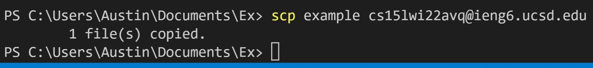

 Lab Report 1: VSCODE, SSH, SCP

***Setting Up Visual Studio Code***

* First I followed this link [Visual Studio](https://code.visualstudio.com/) and chose download
* Then I opened the app and pressed 'file' in the upper left corner and then 'new file' to create a new file. Ive deciced to name the file example.

***Remote Connecting***  

 
* To log into my remote cs15l account on the ieng6 server I first Opened the terminal with Ctrl+backtick in VSCode and wrote the following command: `ssh cs15lwi22avq@ieng6.ucsd.edu` 
The "cs15lwi22avq" should be replaced with your course account.
*  Next an authenticity of host message was displayed and I simply typed yes to make it dissapear.
* Then I entered my account password. Dont be alarmed if you cant see any charachters when you type your password. This is normal.

***Some Commands***

* type to the terminal the following command: `pwd`  

 pwd prints the absolute path to your working directory. Notice you may not recognize any of these directories. That is because you are logged in to the ieng6 server! You are no longer working on your computer.
 * Now type the command:  `mkdir example` 
 * Now type the command: `ls`  
 
 * mkdir creates a new directory and ls prints the files and directories in your current directory.
 
 ***Moving Files With `scp`***

 * `scp` copies files between host on a network
 * To copy the file "example" I created earlier from my current working directory to my ieng6 server account home directory I used the command:
 `scp example cs15lwi22avq@ieng6.ucsd.edu`

***Setting an SSH Key***
* to avoid the hassle of typing my password in everytime I ssh into my remote cs15l account, I used ssh keys so I wouldnt have to do anything.
* To do this, I first typed the command: `$ ssh -keygen`

* then I entered the location to save the ssh key, "C:\Users\Austin/.ssh/id_rsa"
* next I used the following command 
`scp C:\Users\Austin/.ssh/id_rsa.pub cs15lwi22avq@ieng6.ucsd.edu:~/.ssh/authorized_keys` to save the public ssh key file I generated into my remote account on ieng6 in the '~/.ssh/authorized_keys' directory
* Now I can login just using ssh xD

***Optimizing Remote Access*** 

* You can log in to a remote server and perform commands all in one line! 
* To locally run the file "DesignRecipeExamples.java" whose location is the home directory of my cs15l remote account, I wrote the following command: `ssh cs15lwi22avq@ieng6.ucsd.edu "javac DesignRecipeExamples.java ; java DesignRecipeExamples"`

* The quotes are used after an 'ssh' to write additional commands and ';' is used to seperate commands. 
* Another example - `ssh cs15lwi22avq@ieng6.ucsd.edu "ls"`