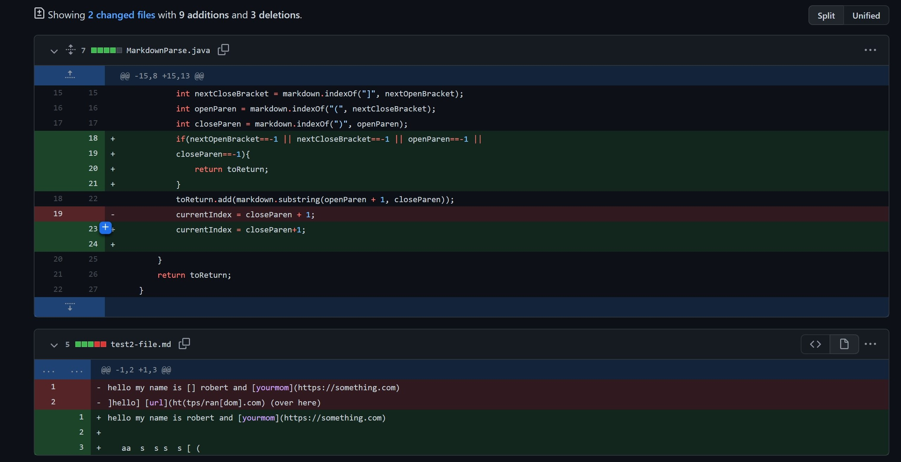
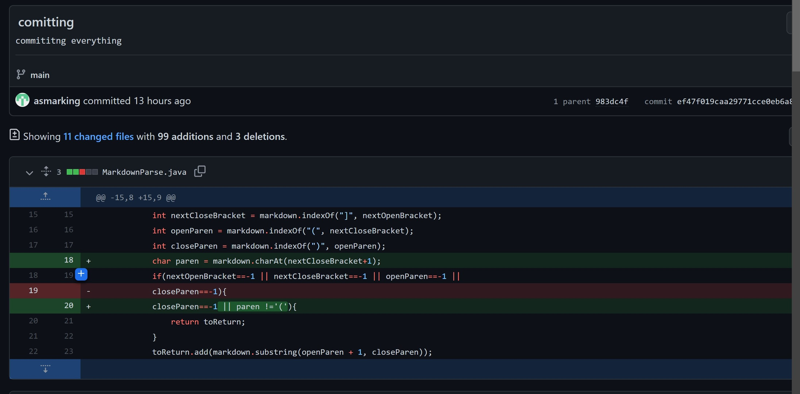
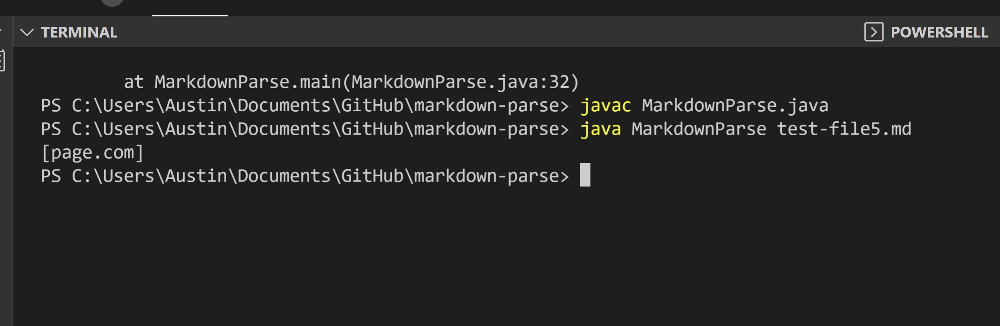
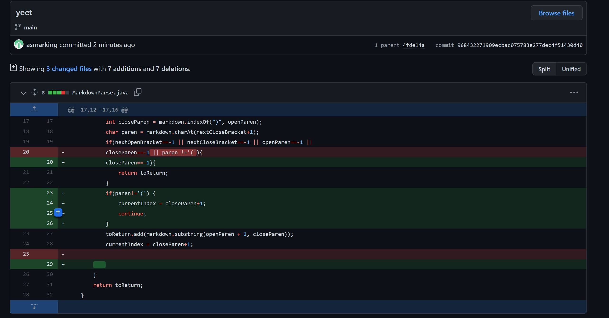

FIRST COMMIT

[failure inducing code](https://asmarking.github.io/markdown-parse/test2-file.md)

bug - code did not check for when indexOf returns -1 which led to the symptom, an infinite loop. The test file contained a bracket but then no parentheses so closeParen = -1 
and that led us to never reach the end of the file (infinite loop).

SECOND COMMIT

[failure inducing code](https://asmarking.github.io/markdown-parse/test-file5.md)  

bug - code did not check if the parentheses for the link came directly after the bracket ']'. This cause getLinks to print "somepage.com" when it should not print anything because the test file contained `[] (somepage.com)`. As you can see this is an invalid link but getLinks did not know because it wasnt checking to see if '(' came directly after ']'.

THIRD COMMIT

  

[failure inducing code](https://asmarking.github.io/markdown-parse/test3-file.md)

The symptom was my program was not printing any links when it should have printed [https://hiIamAlink.com].   

The symptom was a result of my program containing `[] ()` before the legit link `()[https://hiIamAlink]`. The parentheses being not directly after the bracket caused my program to terminiate when it shouldnt have, so the bug is my program terminated anytime a parentheses was not directly after ']'.