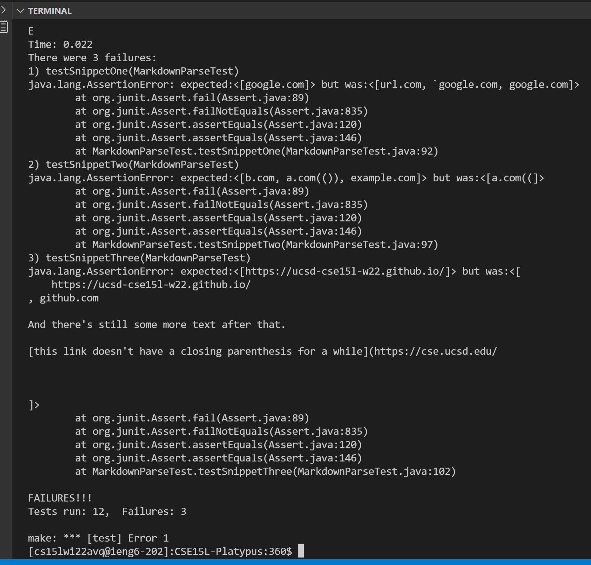

## **Links**

[my markdown-parse repository](https://github.com/asmarking/markdown-parse.git)

[lab partners markdown repository](https://github.com/nseyoum/CSE15L-Platypus.git)

## **snippet one** :

    expected answer ---> List.of("google.com")

    That is a list containing one link, "google.com"

 ## **snippet two** :

    expected answer ---> List.of("b.com","a.com(())","example.com")

    That is a list containing three links, "b.com","a.com","example.com"

## **snippet three** : 

    expected answer ---> List.of("https://ucsd-cse15l-w22.github.io/")

    That is a list containing one link, "https://ucsd-cse15l-w22.github.io/"

## **how to implement test in junit** :    

;

## **Test results**

### **my markdown-parse** 

### **lab partners markdown-parse**

## **Questions**

### **Do you think there is a small (<10 lines) code change that will make your program work for snippet 1 and all related cases that use inline code with backticks?** ### 

I do think the solution could be done in less than ten lines of code. There could be a variable that counts the backticks. Every tick that is encountered would increment the counter by one. When tick counter == 2, everything between the two ticks should be a code block. So just look for the next open parenthesis and reset the tick counter to zero. 

### **Do you think there is a small (<10 lines) code change that will make your program work for snippet 2 and all related cases that nest parentheses, brackets, and escaped brackets?** ###

I also think this program could be fixed by using counters, but not in less than ten lines. You would need 2 variables, one to count the parenthesis and one to count the brackets. Everytime a '(' or '[' is found you increment the counters by one. When a ')' or ']' is found decrement the counters by one. When the counters equal zero you have a valid link. The difficulty is you could not use indexOf for this, because it skips over brackets and parentheses that would need to be counted using the method above.

### **Do you think there is a small (<10 lines) code change that will make your program work for snippet 3 and all related cases that have newlines in brackets and parentheses? If yes, describe the code change. If not, describe why it would be a more involved change.** 
 
If you are only focusing on finding matching pairs of open and closed brackets/parentheses then it should not matter if they are on seperate lines.If you are keeping track of the counters that I mentioned before, then the new line is irrelivant and so using the same implementation for snippet 2 should also work for snippet 3. So assuming the implementation for snippet two is already done correctly, the new lines problem should be fixable in less than ten lines (or zero lines)