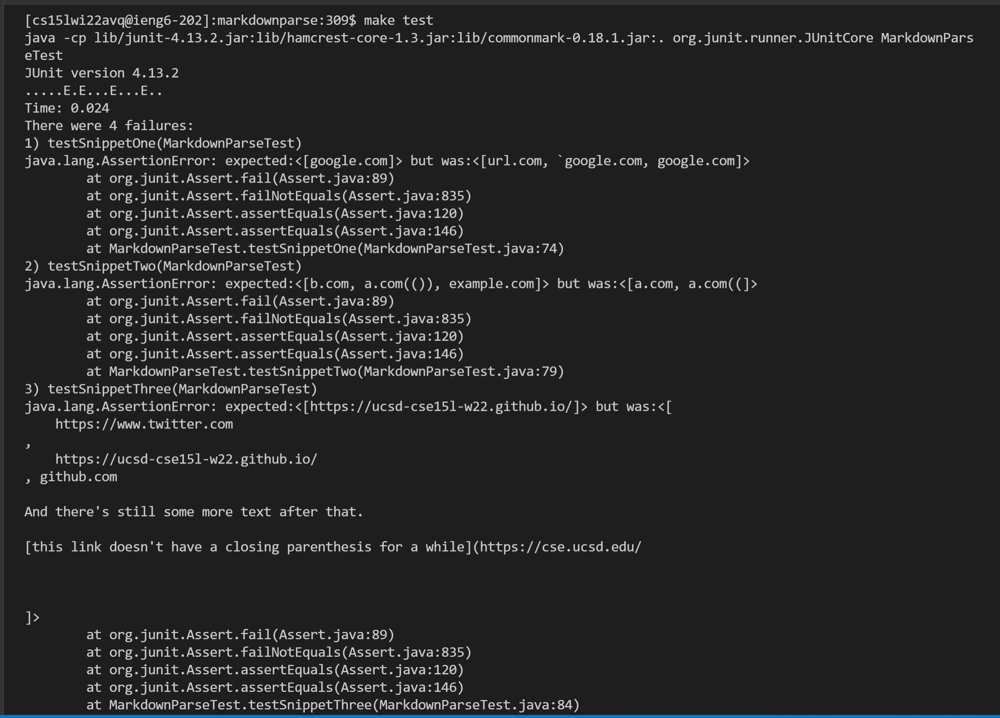

## **snippet one** :

    expected answer ---> List.of("google.com")

    That is a list containing one link, "google.com"

 ## **snippet two** :

    expected answer ---> List.of("b.com","a.com(())","example.com")

    That is a list containing three links, "b.com","a.com","example.com"

## **snippet three** : 

    expected answer ---> List.of("https://ucsd-cse15l-w22.github.io/")

    That is a list containing one link, "https://ucsd-cse15l-w22.github.io/"

## **how to implement test in junit** :    

;

## **Test results**

### **my reporsitory** 

### **lab partners repository**

## **Questions**

### **Do you think there is a small (<10 lines) code change that will make your program work for snippet 1 and all related cases that use inline code with backticks?** ### 

I do think the solution could be done in less than ten lines of code. There could be a variable that counts the backticks. if a second backtick is found then counter would be at two and you can disregard all of the code between the first and second backticks. 

### **Do you think there is a small (<10 lines) code change that will make your program work for snippet 2 and all related cases that nest parentheses, brackets, and escaped brackets?** ###

I also think this program could be fixed by using counters, but not in less than ten lines. You would need 2 varaibles, a counter for parens and brackets. Everytime a '(' or '[' is found you could increment the counters and when a ')' or ']' decrement the counters. When the counters are at zero you have a valid link. The difficulty is you could not use indexOf for this, because it skips over brackets and parentheses  that should be counted.

### **Do you think there is a small (<10 lines) code change that will make your program work for snippet 3 and all related cases that have newlines in brackets and parentheses? If yes, describe the code change. If not, describe why it would be a more involved change.** 
 
If you are only focusing on find matching pairs of open and closed brackets/parentheses then it should not matter if they are on seperate lines.If you are keeping track of the counters that I mentioned before, then the new line is irrelivant and so using the same implementation I mentioned for snippet 2 should also work for snippet 3. So assuming the implementation for snippet two is already done, the new lines problem should be fixable in less than ten lines.