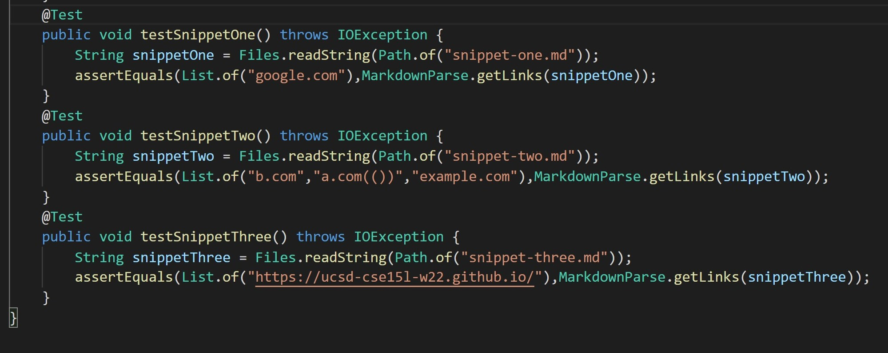
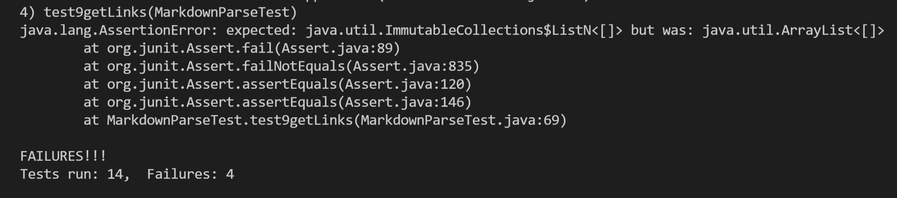

## **snippet one** :

    expected answer ---> List.of("google.com")

    That is a list containing one link, "google.com"

 ## **snippet two** :

    expected answer ---> List.of("b.com","a.com(())","example.com")

    That is a list containing three links, "b.com","a.com","example.com"

## **snippet three** : 

    expected answer ---> List.of("https://ucsd-cse15l-w22.github.io/")

    That is a list containing one link, "https://ucsd-cse15l-w22.github.io/"

## **how to implement test in junit** :    

;

## **results**

