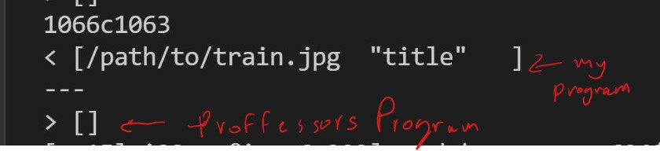
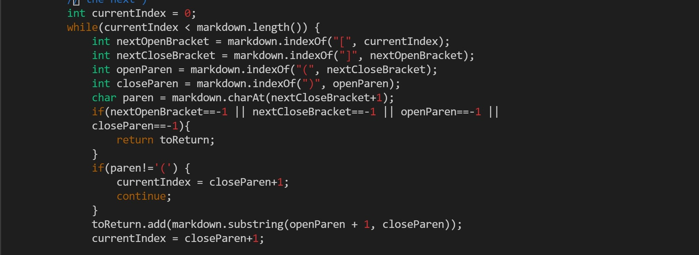

In the directory containing the professors implementation of markdown parse -  
`bash script.sh > othermarkdown.txt`

Then in the directory containing your implementation -   
`bash script.sh > mymarkdown.txt`

to compare the files I ran -  
`diff ~/mymarkdown/markdown-parse/mymarkdown.txt 
~/markdown-parse/othermarkdown.txt > diff.txt`

Then to see where the files differed, I ran -  
`cat diff.txt`   

My programs return value is wrong.  
The professors program return value is right.

I know this because I found the expected output by plugging in the markdown text from file 577.md into this [mark-down-previewer](https://spec.commonmark.org/dingus/)

exepcted output:

'[]'     

....this empty array means there are zero valid links in file 577.md

To fix my code, I need to check if the there is a '!' before []. The file 577.md contains
just one line of markdown :  
``

I could do this by adding another if statement to the condition `if(paren!='('`
that checks if the charachter before the left open bracket '[' is an exclamation point '!' :

if there is a '!', then move the current index to be index = closeParen + 1 and continue to the next loop iteration, this should fix the bug.